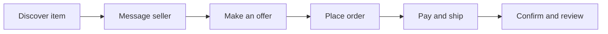
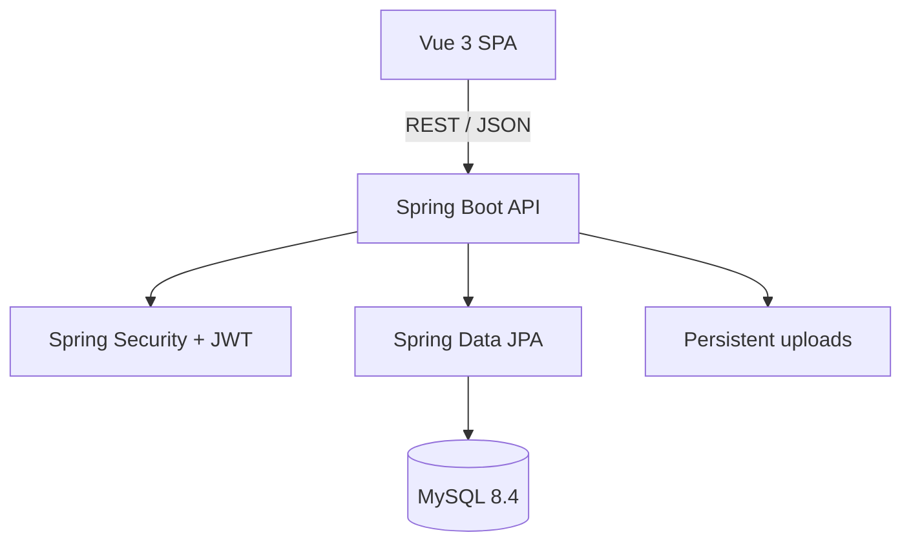

# ReNova

### Give good things a second life.

[](https://github.com/hannnnnnnny/ReNova-Second-Hand-C2C-Marketplace/actions/workflows/ci.yml)


ReNova is a full-stack C2C marketplace for buying and selling pre-loved goods. It brings listings, private conversations, price negotiation, order tracking, reviews, and reputation into one complete bilingual experience.

The project focuses on the difficult parts of a marketplace—not just displaying products, but enforcing who can act, when an order may move forward, and how trust is built after a trade.

[View static preview](https://hannnnnnnny.github.io/NovaCart-Fashion-Commerce-Platform/) · [Development guide](docs/DEVELOPMENT.md) · [Deployment notes](docs/DEPLOYMENT.md)

> The hosted preview is the static Vue application. Backend-connected features require the Spring Boot API and a database.

---

## What ReNova Does

| Experience | Capabilities |
|---|---|
| **Discover** | Browse, search, filter, sort, and inspect second-hand listings |
| **Sell** | Create, edit, manage, and track personal listings |
| **Negotiate** | Make, accept, reject, counter, or withdraw offers |
| **Connect** | Private buyer–seller conversations with unread-message tracking |
| **Trade** | Demo payment, shipping, receipt confirmation, and cancellation workflow |
| **Build trust** | Two-way reviews, public profiles, and aggregated reputation |
| **Personalise** | Favorites, account settings, and English / 简体中文 switching |

## Marketplace Journey



Offers and orders are modelled as explicit state machines, so invalid transitions are rejected by the backend rather than merely hidden in the interface.

```text
Offer:  PENDING → ACCEPTED / REJECTED / COUNTERED / WITHDRAWN
Order:  PENDING_PAYMENT → PAID → SHIPPED → COMPLETED
                                      ↘ CANCELLED
```

Completing an order marks its listing as sold and unlocks two-way reviews.

---

## Architecture



The frontend and backend are deliberately separated. Vue owns presentation and client state; Spring Boot owns validation, authorization, marketplace rules, and persistence.

### Tech Stack

| Layer | Technologies |
|---|---|
| Frontend | Vue 3, Vite, Pinia, Vue Router, Vue I18n, Axios, Lucide |
| Backend | Java 21, Spring Boot, Spring Web MVC, Spring Security, Spring Data JPA |
| Data | MySQL 8.4, H2 for demo and tests |
| Authentication | Stateless JWT, BCrypt password hashing |
| Quality | JUnit, Spring Security Test, Vitest, GitHub Actions |
| Delivery | Docker Compose, Nginx |

### Repository Structure

```text
ReNova-Second-Hand-C2C-Marketplace/
├── backend/                 # Spring Boot REST API
│   └── src/main/java/       # Controllers, services, entities and security
├── frontend/                # Vue single-page application
│   └── src/                 # Pages, components, stores, API and i18n
├── docs/                    # Development and deployment notes
├── docker-compose.yml       # MySQL, backend and frontend
├── docker.env.example       # Docker environment template
└── .github/workflows/       # Automated tests and build
```

---

## Quick Start

### Prerequisites

- Java 21
- Node.js 20+
- npm

MySQL is optional for the self-contained demo profile.

### 1. Start the backend

```bash
git clone https://github.com/hannnnnnnny/ReNova-Second-Hand-C2C-Marketplace.git
cd ReNova-Second-Hand-C2C-Marketplace/backend
./mvnw -DskipTests package
java -jar target/backend-0.0.1-SNAPSHOT.jar --spring.profiles.active=demo
```

Windows PowerShell:

```powershell
cd backend
.\mvnw.cmd -DskipTests package
java -jar .\target\backend-0.0.1-SNAPSHOT.jar --spring.profiles.active=demo
```

The API starts at `http://localhost:8080`. The demo profile uses H2 and seeds categories, users, and starter listings automatically.

### 2. Start the frontend

Open a second terminal:

```bash
cd frontend
npm ci
npm run dev
```

Open `http://localhost:5173`. Vite proxies `/api` requests to the backend during development.

### Demo Accounts

| Email | Password | Role |
|---|---|---|
| `ava@renova.local` | `DemoPassword1!` | User |
| `liam@renova.local` | `DemoPassword1!` | User |
| `nora@renova.local` | `DemoPassword1!` | User |
| `sam@renova.local` | `DemoPassword1!` | User |
| `admin@renova.local` | `DemoAdmin123!` | Admin |

You can also create a new account.

---

## Run with Docker

For a containerised environment with MySQL:

```bash
cp docker.env.example .env
# Replace every __SET_ME__ value before continuing.
docker compose up --build
```

| Service | Local URL |
|---|---|
| Frontend | `http://localhost:3000` |
| Backend API | `http://localhost:8080/api` |
| MySQL | `127.0.0.1:3306` |

Docker Compose refuses to start when required credentials are missing. Database records and uploaded files are stored in named volumes.

---

## Configuration

### Backend

| Variable | Required outside demo? | Purpose |
|---|---:|---|
| `DB_HOST`, `DB_PORT` | No | MySQL connection location |
| `DB_NAME` | Yes | Database name |
| `DB_USERNAME` | Yes | Database user |
| `DB_PASSWORD` | Yes | Database password |
| `JWT_SECRET` | Yes | Signing secret; use at least 32 random bytes |
| `JWT_EXPIRATION_MINUTES` | No | Token lifetime; defaults to 120 minutes |
| `CORS_ALLOWED_ORIGINS` | No | Comma-separated frontend origins |
| `SERVER_PORT` | No | API port; defaults to 8080 |

Generate a signing secret with:

```bash
openssl rand -base64 48
```

### Frontend

```env
VITE_API_BASE_URL=http://localhost:8080/api
```

Use the provided `backend/.env.example`, `frontend/.env.example`, and `docker.env.example` templates as the configuration reference.

---

## Security by Design

ReNova treats the API—not hidden UI controls—as the security boundary.

- Passwords are hashed with BCrypt and never returned in DTOs.
- JWT subjects identify the current user; private actions do not trust a user ID supplied by the browser.
- Listing ownership, conversation participation, offer actions, and order transitions are checked server-side.
- Public profile responses exclude email addresses.
- Production startup rejects missing, weak, or known-placeholder JWT secrets.
- Docker credentials are supplied through environment variables with no committed fallback secrets.
- Generic authentication failures reduce account-enumeration leakage.

The `demo` profile generates a fresh random JWT secret for each JVM and is intended only for local evaluation.

---

## Verification

```bash
# Backend
cd backend
./mvnw test

# Frontend
cd frontend
npm ci
npm run test:unit
npm run build
```

The automated suites cover password handling, hostile cross-user requests, authorization boundaries, secret validation, the complete marketplace transaction loop, utility functions, and English/Chinese translation parity.

GitHub Actions runs backend tests plus frontend tests and the production build on every push to `main` and every pull request.

---

## API Overview

| Area | Representative endpoints |
|---|---|
| Authentication | `POST /api/auth/signup`, `POST /api/auth/login`, `GET /api/auth/me` |
| Listings | `GET /api/public/listings`, `POST /api/listings`, `PUT /api/listings/{id}` |
| Offers | `POST /api/offers`, `POST /api/offers/{id}/accept`, `GET /api/offers/received` |
| Conversations | `GET /api/conversations`, `POST /api/conversations/{id}/messages` |
| Orders | `POST /api/orders`, `POST /api/orders/{id}/pay`, `/ship`, `/confirm-receipt` |
| Reviews | `POST /api/reviews` |
| Profiles | `GET /api/public/users/{id}`, `PUT /api/users/me` |

Successful and failed responses use a consistent JSON envelope with a message, data or error details, and timestamp.

---

## Current Scope

ReNova is a portfolio project and does not process real money. The payment action demonstrates an escrow-style order state transition.

Before production use, the platform would need a payment provider, verified webhooks, refunds and reconciliation, dispute tooling, rate limiting, observability, backups, and formal database migrations.

## Roadmap

- Real payment-provider integration and webhook reconciliation
- Realtime conversations with WebSocket or SSE
- Buyer and seller dispute workflow
- Admin moderation dashboard
- Notifications and saved-search alerts
- Production observability and load testing

---

Built by [Harry Han](https://github.com/hannnnnnnny).
